

**Wavebound**

Martin Chuděj, Lukáš Černoch

# Obsah
[Stručné shrnutí	3](#_toc195556670)

[Podrobné shrnutí	3](#_toc195556671)

[Pilíře designu	3](#_toc195556672)

[Příběh	3](#_toc195556673)

[Prostředí	3](#_toc195556674)

[Hlavní dějové body	3](#_toc195556675)

[Svět	4](#_toc195556676)

[Postavy	6](#_toc195556677)

[Herní struktura	6](#_toc195556678)

[Herní smyčka	6](#_toc195556679)

[Ovládání	7](#_toc195556680)

[Nepřátelé	7](#_toc195556681)

[Herní mechaniky	8](#_toc195556682)

[Stavy AI nepřátel	9](#_toc195556683)

[Grafika a zvuk	9](#_toc195556684)

[Grafické požadavky	9](#_toc195556685)

[Zvuk	9](#_toc195556686)

[Přehled úrovní	10](#_toc195556687)

[UI	10](#_toc195556688)

[Menu	10](#_toc195556689)

[Vývojové nástroje	10](#_toc195556690)

[Potřebné programy	10](#_toc195556691)

[Tým	11](#_toc195556692)

[Analýza trhu	11](#_toc195556693)

[Cílový trh	11](#_toc195556694)

[Největší konkurenti	11](#_toc195556695)

[Porovnání funkcí	11](#_toc195556696)

[Plán hodnocení rizik	12](#_toc195556697)

[Rizika vývoje Během vývoje mohou nastat různá rizika, jako například:	12](#_toc195556698)

# Stručné shrnutí
Wavebound je akční rogue-like hra inspirovaná populárními tituly jako Vampire Survivors. Hráči se ujmou role mága, který musí přežít v neustále se zhoršujícím prostředí temného lesa, zatímco bojuje proti hordám nepřátel. Hra se zaměřuje na rychlou akci, vylepšování postavy a taktické využívání magických schopností. V budoucnu bude hra rozšiřována o nové postavy, úrovně a herní mechaniky.
# Podrobné shrnutí
Wavebound je akční rogue-like, kde hráči čelí nekonečným vlnám nepřátel, přičemž se neustále zlepšují v magických schopnostech a schopnostech přežití. Hra je navržena v 2D stylu s rychlým bojem a důrazem na strategii. Každý přežitý level přináší nové výzvy a příležitosti k vylepšení. Postavy budou v budoucnu variabilní, přičemž každá bude mít své jedinečné schopnosti. Herní prostředí, jako temný les, bude různé a stále náročnější.

# Pilíře designu
Rychlá akce, Horror, Rogue-like
# Příběh
Hráč se ujímá role mága, jehož úkolem je zastavit temnou magii, která ohrožuje celý svět. Tento mág je vyslán do temného lesa, kde se začínají objevovat neznámé a zlověstné síly, které ničí vše, co jim přijde do cesty. Cílem je najít a zničit pramen tohoto zla, ať už se skrývá kdekoliv, přičemž hráč odhaluje tajemství temné magie a jejího původního tvůrce.
## Prostředí
Hra se odehrává ve středověkém fantasy světě, kde magie a temné síly jsou součástí každodenního života. Hlavní dějištěm je temný les, který je plný nebezpečných stvůr a záhadných sil. Tento les není jediným prostředím – hra bude pokračovat do dalších temných a magických oblastí, ale les je klíčovým místem pro odhalení hlavní hrozby.
## Hlavní dějové body
Při průchodu zkaženým lesem mág narazí na podivný kruh run vyrytý do země. Když do něj vstoupí a spustí tím prastarý magický rituál Les se promění v nekonečnou smyčku vln nepřátel, kterou může zlomit pouze nalezením ztraceného ohniska magie — jádra, které drží celé prokletí pohromadě.
## Svět
Svět Wavebound je temný a nebezpečný, s přírodními i magickými hrozbami, které číhají na každém kroku. Temné lesy jsou hlavním místem děje, ale svět se rozšiřuje o ruiny starobylých měst a magické oblasti, které budou hráči postupně zpřístupněny. 

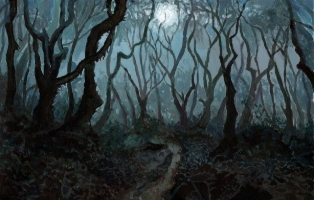 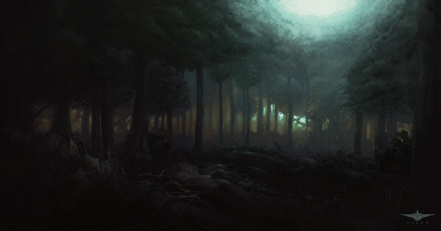

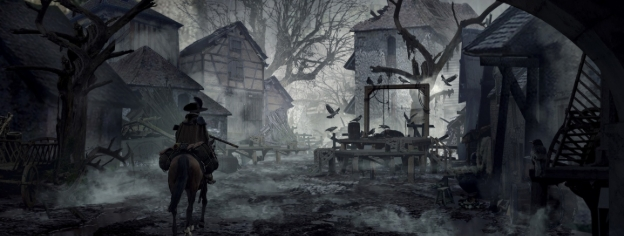

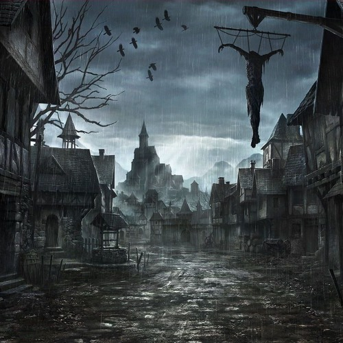

## Postavy

|
**Mág** (hlavní postava)

**Jméno:** Caelum Virel **Věk:** 54 **Osobnost:** Klidný, odměřený, 

**Původ:** Vyrostl v klášteře zasvěceném studiu magie na okraji starého lesa

**Zájmy:** Staré magické texty, astronomie, alchymie a sbírání podivných artefaktů. **Vzhled:** Nosí dlouhý potrhaný plášť z tmavé látky a hůl. Je vysoký, štíhlý.
|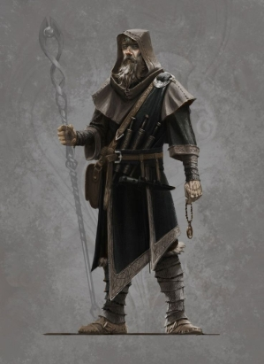|
| :- | :- |

# Herní struktura
Herní struktura *Wavebound* staví na přežívání v neustále sílících vlnách nepřátel v omezeném prostředí. Hráč musí sbírat zkušenosti, zlepšovat schopnosti a strategicky se pohybovat, aby přežil co nejdéle. Cílem je vytvořit intenzivní, opakovatelný zážitek, který odměňuje zlepšování dovedností a objevování nových kombinací schopností.
## Herní smyčka
Hráč prochází úrovněmi, kde čelí vlnám nepřátel a zároveň odhaluje střípky příběhu. Každá dokončená úroveň přináší nové výzvy, zlepšení postavy a mění svět kolem hráče. Příběh se postupně odkrývá, jak hráč prochází těmito změnami a přizpůsobuje se neustále rostoucí obtížnosti.
## Ovládání
Klávesnice a myš

## Nepřátelé

|**Vlkodlak** Rychlý a agresivní, tento nepřítel se k hráči přiblíží a útočí dotykem.|
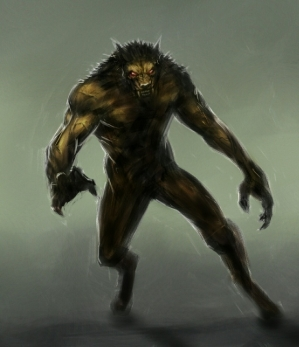

|
| :- | :- |
|
**Bažiné monstrum**

Pomalu se pohybující bytost, která se snaží hráče zachytit a zranit dotykem.
|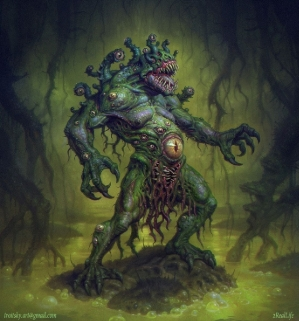|
|**Netopýr** Malý a rychlý, útočí ve vlnách, přiblíží se a zaútočí dotykem.|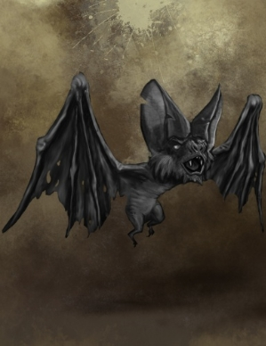|
## Herní mechaniky
Útoky postavy budou automatické, podobně jako ve Vampire Survivors, takže hráč se může soustředit na pohyb a strategii. Při každém level upu si hráč bude moci vybrat novou schopnost, která změní jeho herní styl a nabídne různé možnosti, jak čelit rostoucím vlnám nepřátel.

## Stavy AI nepřátel
Nepřátelé se budou pohybovat za hráčem a snažit se ho dotknout, čímž mu odeberou život. Stejně jako ve Vampire Survivors budou nepřátelé následovat hráče a neustále ho pronásledovat, dokud se nedostanou do kontaktu.

# Grafika a zvuk
## Grafické požadavky
Hra bude mít pixelovou grafiku, která bude generována pomocí AI, což umožní vytvářet unikátní vizuální styl pro každou úroveň a nepřátele, přičemž zachová retro atmosféru.

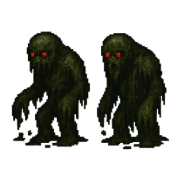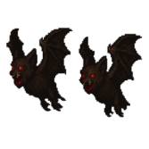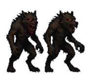
## Zvuk
Zvuková stránka hry, včetně hudby a efektů, bude také generována pomocí AI, čímž zajistíme originální zvukový design, který podpoří atmosféru hry a každou vlnu nepřátel.

# Přehled úrovní
Úroveň začne v temném lese, kde hráč čelí vlnám nepřátel. Les je plný stromů, pařezů a tmavých oblastí. Jak hráč postupuje, prostředí se mírně mění, ale základní vzhled zůstává stejný. Další úrovně budou mít podobnou strukturu, ale s novými prvky a výzvami.

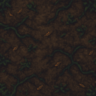
# UI
## Menu
**Hlavní menu**
Hráč bude mít možnost začít novou hru, pokračovat ve hře nebo upravit nastavení.

**Nastavení**
Nastavení umožní upravit zvuk, grafiku a ovládání hry podle preferencí hráče.

# Vývojové nástroje
## Potřebné programy
Pro vývoj hry používáme Godot Engine pro samotnou tvorbu hry. K vytvoření grafiky a zvuku využíváme AI nástroje, jako jsou například Pixel Art generátory a AI pro generování hudby a efektů.

# Tým

|Programátor/Zvuk|Lukáš Černoch|
| :- | :- |
|Programátor/Design|Martin Chuděj|
# Analýza trhu
## Cílový trh
Hra cílí na hráče na platformě Steam, přičemž oslovuje širokou věkovou skupinu, především mezi 13 a 35 lety. Kvůli atmosféře hororu a temné přírodě hry je zaměřena na mladší publikum, které hledá intenzivní, ale ne příliš děsivý zážitek.
## Největší konkurenti
- Vampire Survivors

- Dead Cells

- Hades
## Porovnání funkcí
- Vampire Survivors: Podobné herní mechaniky s automatickými útoky a vlnami nepřátel, ale naše hra má snový, temnějším prostředí a zaměřuje se na růst příběhu prostřednictvím změn ve světě.

- Dead Cells: Rychlá akce s roguelike prvky, ale naše hra má jednodušší pohyb a větší důraz na strategii při volbě schopností během level upu.

- Hades: Roguelike s podobnými prvky, ale naše hra má specifický, lovecraftovský hororový nádech a herní prostředí se neustále mění podle postupu.

# Plán hodnocení rizik
Rizika vývoje
Během vývoje mohou nastat různá rizika, jako například:
-------------------------------------------------------
- **Finanční problémy**: Nedostatek prostředků na pokračování vývoje.
- **Výpadky techniky**: Selhání vývojového počítače nebo nástrojů pro tvorbu grafiky a zvuků, což by mohlo zpomalit postup.
- **Podpora herního enginu**: Možná změna ve verzi nebo ukončení podpory pro použité nástroje (Godot Engine).
- **Ztráta dat**: Nezálohování projektových souborů nebo ztráta důležitých dat.

V případě problémů bude vytvořen záložní plán, který zahrnuje pravidelnou zálohu projektů a možnost přizpůsobit se změnám v použitých nástrojích.

